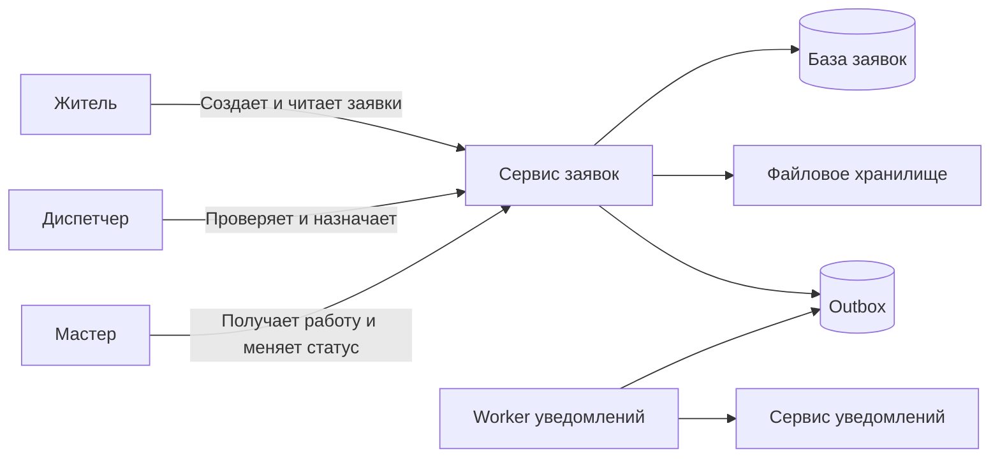
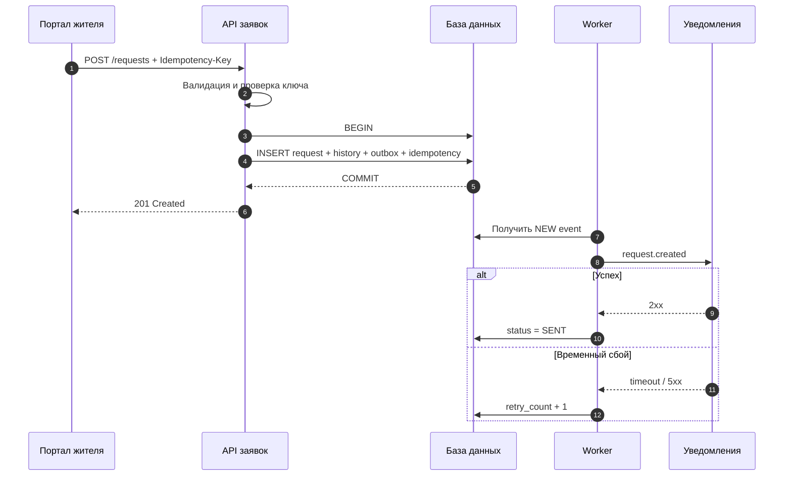
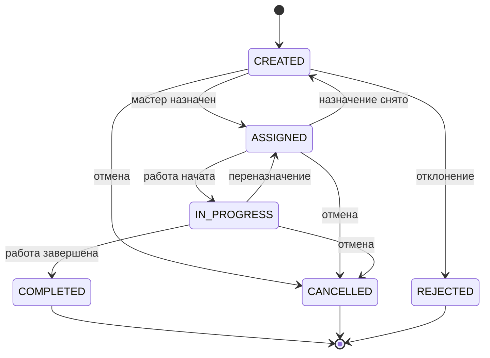
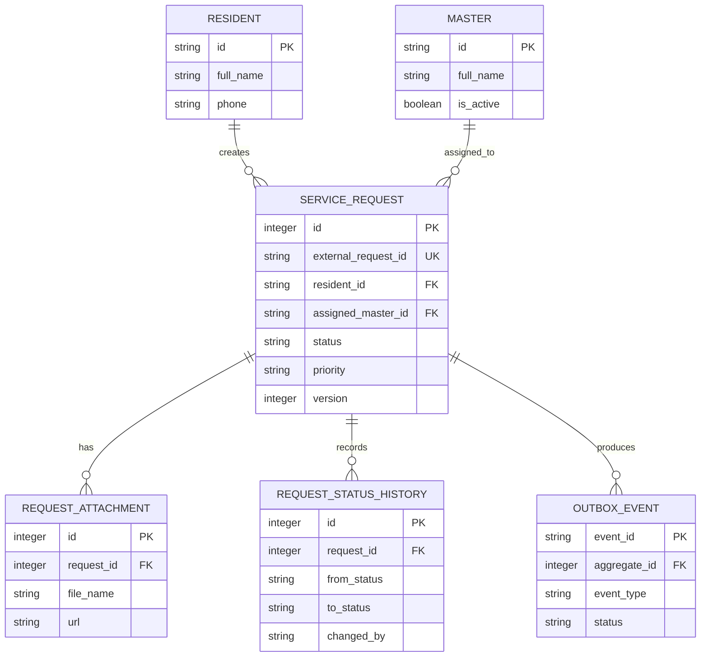

# Диаграммы

Диаграммы хранятся в Mermaid и отображаются непосредственно в GitHub.

## Контекст системы

```mermaid
flowchart LR
    Resident[Житель] -->|Создает и читает заявки| API[Сервис заявок]
    Dispatcher[Диспетчер] -->|Проверяет и назначает| API
    Master[Мастер] -->|Получает работу и меняет статус| API
    API --> DB[(База заявок)]
    API --> Files[Файловое хранилище]
    API --> Outbox[(Outbox)]
    Worker[Worker уведомлений] --> Outbox
    Worker --> Notify[Сервис уведомлений]
```

## Создание заявки

```mermaid
sequenceDiagram
    autonumber
    participant C as Портал жителя
    participant A as API заявок
    participant D as База данных
    participant W as Worker
    participant N as Уведомления
    C->>A: POST /requests + Idempotency-Key
    A->>A: Валидация и проверка ключа
    A->>D: BEGIN
    A->>D: INSERT request + history + outbox + idempotency
    D-->>A: COMMIT
    A-->>C: 201 Created
    W->>D: Получить NEW event
    W->>N: request.created
    alt Успех
        N-->>W: 2xx
        W->>D: status = SENT
    else Временный сбой
        N-->>W: timeout / 5xx
        W->>D: retry_count + 1
    end
```

## Жизненный цикл заявки

```mermaid
stateDiagram-v2
    [*] --> CREATED
    CREATED --> ASSIGNED: мастер назначен
    CREATED --> CANCELLED: отмена
    CREATED --> REJECTED: отклонение
    ASSIGNED --> CREATED: назначение снято
    ASSIGNED --> IN_PROGRESS: работа начата
    ASSIGNED --> CANCELLED: отмена
    IN_PROGRESS --> ASSIGNED: переназначение
    IN_PROGRESS --> COMPLETED: работа завершена
    IN_PROGRESS --> CANCELLED: отмена
    COMPLETED --> [*]
    CANCELLED --> [*]
    REJECTED --> [*]
```

## Модель данных

```mermaid
erDiagram
    RESIDENT ||--o{ SERVICE_REQUEST : creates
    MASTER ||--o{ SERVICE_REQUEST : assigned_to
    SERVICE_REQUEST ||--o{ REQUEST_ATTACHMENT : has
    SERVICE_REQUEST ||--o{ REQUEST_STATUS_HISTORY : records
    SERVICE_REQUEST ||--o{ OUTBOX_EVENT : produces

    RESIDENT {
      string id PK
      string full_name
      string phone
    }
    MASTER {
      string id PK
      string full_name
      boolean is_active
    }
    SERVICE_REQUEST {
      integer id PK
      string external_request_id UK
      string resident_id FK
      string assigned_master_id FK
      string status
      string priority
      integer version
    }
    REQUEST_ATTACHMENT {
      integer id PK
      integer request_id FK
      string file_name
      string url
    }
    REQUEST_STATUS_HISTORY {
      integer id PK
      integer request_id FK
      string from_status
      string to_status
      string changed_by
    }
    OUTBOX_EVENT {
      string event_id PK
      integer aggregate_id FK
      string event_type
      string status
    }
```
